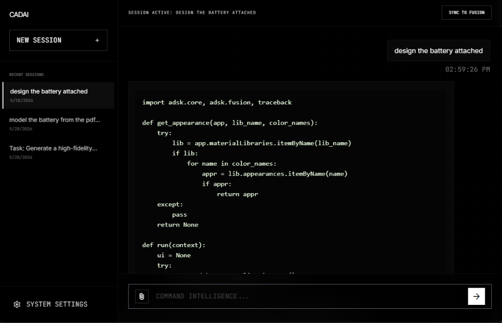
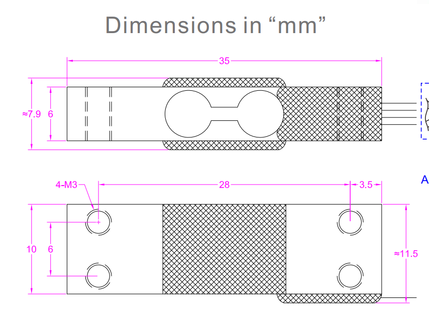
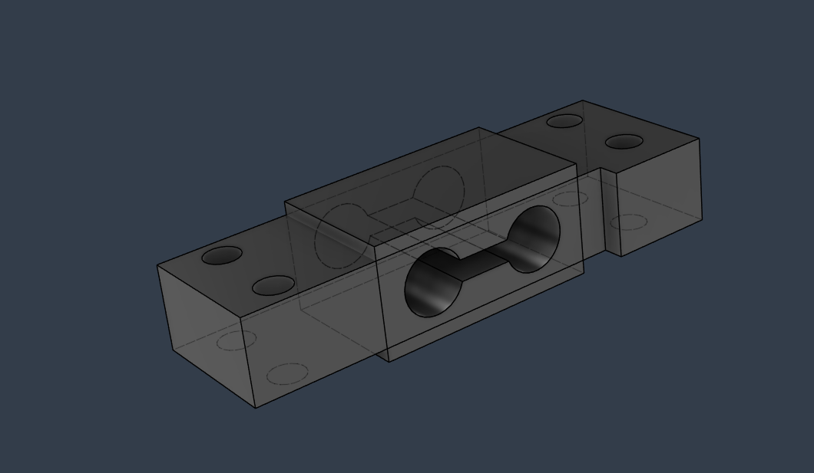

# CADAI - Fusion 360 AI Assistant

CADAI is a highly tailored, standalone desktop AI assistant specifically designed for Autodesk Fusion 360 API scripting. Using advanced Gemini integration, it acts as a "Copilot" for your CAD designs, helping you rapidly build complex parametric geometries, assemblies, and automation scripts directly from natural language.



## Watch it in action

[▶️ Click here to watch the full CADAI Demo Video](assets/CADAI_DEMO.mov)

## Features

- **Fusion 360 Script Auto-Sync**: The app seamlessly connects your AI chat sessions to a Fusion 360 Python script location of your choice. Any code generated in the active session can be synced to Fusion 360 with a single click, allowing instant iteration and testing.
- **Persistent AI Chat Sessions**: Keep track of various projects simultaneously. Chats and generated scripts are automatically cached securely on your local machine (`~/.cadai/sessions/`), letting you quickly switch contexts.
- **Multimodal Prompting & Attachments**: Drag and drop screenshots, PDFs, or text documents directly into the chat. The AI will use these to understand engineering constraints, reference designs, and complex geometries.
- **Advanced UI Aesthetics**: CADAI runs via `pywebview` utilizing a heavily customized, dark-themed HTML/CSS/JS frontend powered by Tailwind, giving it a premium glass-morphic feel designed explicitly for desktop setups.
- **Optimized for Fusion 360 API**: The backend actively trains the AI with a strictly curated set of rules tailored to the Autodesk Fusion 360 API architecture, avoiding common pitfalls like parametric modeling setup issues or internal unit conversion failures.

## Capabilities Showcase

Just drag and drop a schematic or PDF into the chat, and the AI will automatically parse the dimensions and constraints to generate the exact parametric CAD model directly in Fusion 360.

**Prompt**: *"design the attached cell"*

|||
|:---:|:---:|
|**Input (Schematic)**|**Result (Fusion 360 Body)**|

## Architecture

CADAI operates as a local hybrid desktop application:
- **Backend (Python + Flask)**: Manages API keys, handles API streaming from Google's Generative AI servers, and synchronizes files with your system.
- **Frontend (HTML/JS/Tailwind)**: A highly responsive and dynamic UI running within a lightweight `pywebview` window.

## Installation & Setup

1. **Clone the repository** and install dependencies:
   ```bash
   pip install -r requirements.txt
   ```
2. **Run the Application**:
   ```bash
   python main.py
   ```
3. **Configure Settings**:
   - In the app, click **System Settings**.
   - Input your **Gemini API Key**.
   - Use the **Browse** button to select your target Fusion 360 script file (e.g. `C:\Users\username\AppData\Roaming\Autodesk\Autodesk Fusion 360\API\Scripts\MyScript\MyScript.py`).

## Usage

1. Open a **New Session** or select an existing one.
2. Type your design constraints or attach references (e.g., "Create a helical gearbox with 12 teeth...").
3. As the AI generates the Python code, click **SYNC TO FUSION** to automatically write the generated script into your designated Fusion 360 directory.
4. Run the script directly from the Fusion 360 Add-In menu.

## Security & Privacy

This repository contains absolutely no sensitive information, hardcoded keys, or personal chat histories.
- **API Keys** are securely stored in your OS's native credential manager using the `keyring` library.
- **Chat History** is strictly stored locally in your home directory at `~/.cadai/sessions/`.
- **Local Configurations** are stored securely in `~/.cadai_config.json`.
